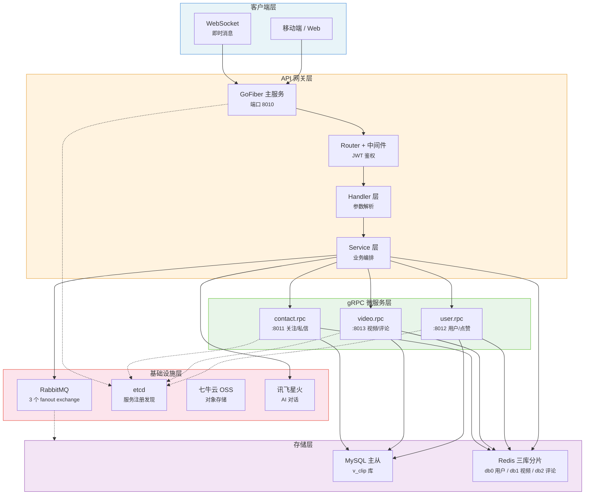
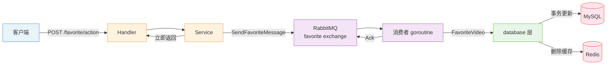
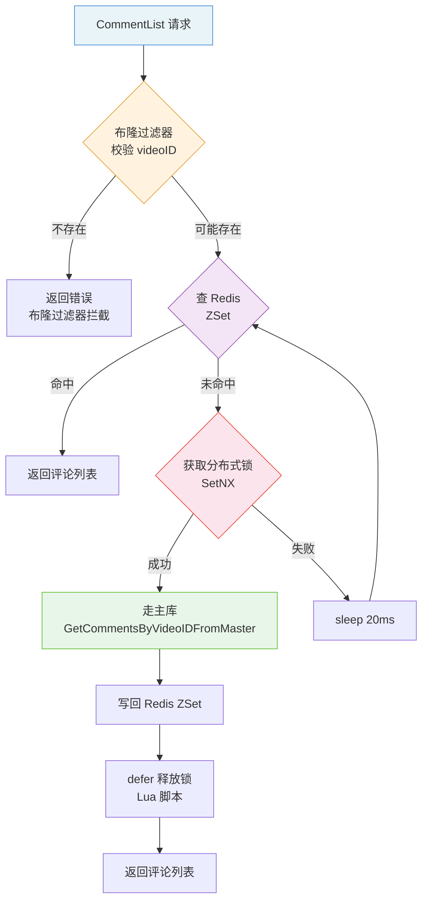

# click-video


个人项目。一个短视频后端系统，采用 GoFiber API 网关 + gRPC 微服务 + RabbitMQ 异步解耦 + MySQL 主从 + Redis 多库分片的架构，提供视频发布、Feed 流、点赞、评论、关注、私信、搜索、AI 聊天等完整功能。

Go 1.20 | HTTP 入口：`douyin`（端口 8010）

***

## 核心特性

- **API 网关 + 三微服务架构** — GoFiber 主服务作为 API 网关与业务编排层，通过 etcd 服务发现调用 user.rpc / video.rpc / contact.rpc 三个 gRPC 微服务，职责按业务领域划分
- **RabbitMQ 异步解耦三大高频写** — 点赞、评论、关注全部走 fanout exchange + 持久化消息 + 手动 ACK，主流程立即返回，消费者后台落库并更新缓存
- **Redis 三库分片 + 冷热分离** — 用户/视频/评论分别落到 Redis db 0/1/2；固定信息用 String(JSON)、频变计数用 Hash，Pipeline 批量执行降低 RTT
- **三重缓存防护** — 布隆过滤器拦截非法 ID 防穿透、SetNX+Lua 分布式锁防击穿、基础 TTL + 随机偏移防雪崩
- **MySQL 主从 + 强制读主** — 基于 dbresolver 的读写分离骨架，评论列表等"写后立即读"场景用 `dbresolver.Write` 强制走主库规避复制延迟
- **go-zero MapReduce 并发聚合** — 点赞列表等"N 视频 → N 作者"聚合查询用 `mr.MapReduce` 并发执行，`orderMp` 解决乱序回填

- **FFmpeg 视频抽帧 + 七牛云 OSS 预留** — 发布视频时用 `ffmpeg-go` 抽取首帧生成封面，本地静态服务提供 playURL，七牛云 SDK 已集成可切换

***

## 架构概览

系统分为五个层次，各层职责明确、依赖单向：



核心数据流（以点赞为例的异步链路）：



评论列表的缓存击穿防护流程：



***

## 模块详解

### 数据访问层 — database/

数据访问层呈现"双轨制"特征：本地直连 DB（用于读多写少、批量聚合）与 RPC 远程调用（用于写操作和"写后立即读"）并存，反映项目从单体向微服务演进的过程。

**读写分离骨架**（`database/init.go`）：基于 `gorm.io/plugin/dbresolver` 的实现已被注释保留，设计意图是 Sources（主库）处理写、Replicas（从库）处理读、`RandomPolicy` 负载均衡。当前所有读写都走主库，但 `GetCommentsByVideoIDFromMaster` 仍保留 `dbresolver.Write` 子句作为强制读主的标记。

**事务模式**：所有核心写操作都在 GORM 事务内完成多表更新。以点赞为例（`database/favorite.go`）：查重 → 增删 favorite 表 → 更新 video.favorite_count → 更新作者 user.total_favorited → 更新点赞者 user.favorite_count → 删除相关缓存，五步在一个事务内原子完成。

**关键 SQL 优化**：

| 优化点 | 位置 | 说明 |
|--------|------|------|
| UNION 替代 OR | `database/message.go` | 私信双向查询用 UNION 避免索引失效 |
| right join 聚合 | `database/video.go` | Feed 流一次性联查 user+video，按 publish_time desc 排序 limit 30 |
| 全文索引 | `database/video.go` | `match(title,topic) against(?)` 配合 ngram 分词器支持中文搜索 |
| 联合唯一索引 | `model/favorite.go`、`model/relation.go` | `(UserID,VideoID)` / `(UserID,ToUserID)` 防重复点赞/关注 |

**特点**：

- **强制读主规避主从延迟**：评论写入后立即查询需要看到最新数据，`GetCommentsByVideoIDFromMaster` 强制走主库。`service/publish.go` 注释明确说明这一设计意图。
- **RPC 与本地 DB 混用**：写操作和"写后立即读"走 RPC（保证事务一致），纯读且需要跨表聚合的走本地 DB（减少 RPC 开销）。代码中大量保留被注释的本地 DB 调用，是单体向微服务迁移的痕迹。
- **模型层提供 Transform\* 函数**：本地 model 与 RPC protobuf 类型互转，隔离两层的数据结构。

### 缓存层 — package/cache/

**三库分片策略**（`cache/init.go`）：

| 客户端 | db | 用途 | 数据结构 |
|--------|----|----|---------|
| UserRedisClient | 0 | 用户信息、关注/粉丝集合 | String(JSON) + Hash(计数) + Set(集合) |
| VideoRedisClient | 1 | 视频信息、点赞集合、发布集合 | String(JSON) + Hash(计数) + Set(集合) |
| CommentRedisClient | 2 | 评论列表 | ZSet(score=时间戳) |

**冷热分离设计**（`cache/user.go`、`cache/video.go`）：将信息拆为两部分——固定信息（用户名/头像/签名、视频 URL/标题）用 String 存 JSON，变更频率低、整体读写；计数信息（关注数/粉丝数/点赞数、评论数）用 Hash 存，频繁变动、支持单字段更新。注释明确说明："若直接存储在 hash 里 会频繁变动性能问题"。

**三重缓存防护**：

| 防护 | 实现 | 位置 |
|------|------|------|
| 缓存穿透 | 布隆过滤器（10 万元素，1% 误报率）+ Set 空集合占位 | `cache/init.go`、`service/comment.go` |
| 缓存击穿 | SetNX 分布式锁 + Lua 脚本原子释放 + UUID 持有者校验 | `cache/lock.go`、`service/comment.go` |
| 缓存雪崩 | 基础 TTL 400s + `rand.Intn(100~200)s` 随机偏移 | 所有 Set 操作 |

**分布式锁实现**（`cache/lock.go`）：

```go
// 加锁：SetNX 保证原子性
SetNX(key, uuid, expiration)

// 解锁：Lua 脚本保证"判断 value + 删除 key"原子性，避免误删别人的锁
if redis.call("get",KEYS[1]) == ARGV[1] then
    return redis.call("del",KEYS[1])
else
    return 0
end
```

**Cache-Aside 一致性策略**：写操作后**删除**缓存（而非更新），避免并发更新导致的数据不一致。删除范围覆盖所有受影响的 key（跨 db 也删）。典型如点赞操作删除 5 个 key：用户计数、作者计数、视频信息、视频计数、点赞集合。

**特点**：

- **Pipeline 批量执行**：所有涉及多 key 的读写都用 `Pipeline` 一次发送，减少网络往返。
- **评论 ZSet 按时间倒序**：`ZAdd` 以创建时间毫秒戳为 score，`ZRevRange(0, -1)` 直接返回时间倒序列表。
- **空集合占位防穿透**：初始化时加入 `"0"` 维持 key 存在，注册时主动写入空集合。
- **布隆过滤器只增不减**：删除视频后过滤器仍认为存在（假阳性），且进程内内存存储多实例不共享。

### RPC 微服务层 — rpc/

三个微服务严格遵循 go-zero 的 `goctl rpc` 生成代码结构，分层如下：

| 层 | 职责 | 示例 |
|----|------|------|
| 入口 `rpc/<svc>/<svc>.go` | 加载配置、注册 etcd、启动服务 | `rpc/user/user.go` |
| Server `internal/server/` | gRPC 接口薄层，仅转发参数 | `user_server.go` |
| Logic `internal/logic/` | 业务逻辑核心，`ctx + svcCtx + logx.Logger` 三件套 | `select_user_by_i_d_logic.go` |
| ServiceContext `internal/svc/` | 依赖注入（Config + DBList） | `service_context.go` |
| Config `internal/config/` | 内嵌 `zrpc.RpcServerConf` + DBListConf | `config.go` |
| Client `rpc/<svc>_client/` | 接口 + 默认实现 + 类型别名 | `user.go` |

**三个微服务职责划分**：

| 服务 | 端口 | etcd Key | 职责 |
|------|------|----------|------|
| user.rpc | 8012 | user.rpc | 用户 CRUD、作品统计、点赞关系（用户视角）、搜索用户 |
| video.rpc | 8013 | video.rpc | 视频 CRUD、Feed 流（全部/按话题）、视频搜索、评论 CRUD |
| contact.rpc | 8011 | contact.rpc | 关注关系、粉丝列表、私信、最近消息 |

**特点**：

- **共享数据库 + 主服务编排**：三个 RPC 服务共用同一个 MySQL 库 `v_clip`，服务间无直接调用，所有跨域逻辑由主 API 服务编排。例如 Feed 流需要作者信息，video.rpc 直接 SQL 右连接 user 表，而非调用 user.rpc。
- **NonBlock 客户端**：主服务用 `zrpc.MustNewClient` + `NonBlock: true` 创建客户端，允许 RPC 服务晚于主服务启动。
- **开发模式反射**：`c.Mode == DevMode || TestMode` 时注册 gRPC reflection，便于 `grpcurl` 调试。
- **Logic 层事务模式**：多表写操作用 GORM 事务保证一致性，例如 `favorite_video_logic.go` 在事务内完成 favorite 表 + video 计数 + 作者计数 + 点赞者计数四步更新。
- **迁移未完成**：部分查询仍走主服务的本地 `database` 包（如 `SelectUserByID`、`SelectUserListByIDs`），RPC 化尚未全部完成。

### Service 层 — service/

Service 层是业务核心，承担缓存策略、消息队列异步化、RPC 调用、数据装配。

**评论发布（异步 + 雪花 ID）**：`PostComment` 用 `util.GetSonyFlakeID()` 生成评论 ID，构造 `model.Comment` 投递到 RabbitMQ `comment` exchange，**异步落库**；同步查用户信息后立即返回 `BuildComment`，不需要等数据库写入。

**点赞列表（MapReduce 并发聚合）**：`FavoriteList` 用 go-zero 的 `mr.MapReduce` 并发查询每个视频的作者信息，用 `orderMp` 记录原始顺序解决并发结果乱序回填问题。这是处理"N 视频 → N 作者"聚合查询的典型模式。

**好友列表（交集算法）**：`RelationFriendList` 同时取关注集合和粉丝集合，取**交集**即为好友（互相关注），额外把 `llm.ChatGPTID` 加入好友列表让用户能和 AI 聊天。代码中 `// FIXME这里循环查库了 记得规避` 标注了 N+1 查询问题。

**Feed 流分页**：`GetFeed` 根据 `Topic` 是否为空选择全部流或按话题流，固定拉 30 条；`LatestTime` 限制最晚时间戳实现按时间分页；`nextTime` 取本批视频中最旧的 `PublishTime` 作为下次请求的 `latest_time`。

**私信 AI 分流**：`MessageAction` 校验链——不能给自己发、内容非空、ActionType="1"；若 `ToUserID == llm.ChatGPTID` 走 LLM 分支，否则双向校验互相关注（非好友拒绝）后 RPC 落库。

**特点**：

- **注册/登录缓存预热**：注册时异步写入布隆过滤器、用户信息、空点赞集、空关注集，用 0 值维护 key 存在性避免缓存穿透。
- **登录限流**：Redis `login_counter:{username}` 5 分钟最多 5 次。
- **弱密码校验**：拒绝 `123456`。
- **变量作用域 bug**：`service/video.go` 中 `likingVideos := resp.UserIDs` 用 `:=` 在 if 内新建局部变量，外层 `likingMap` 实际为空，已登录用户的点赞标记会失效。

### Handler 层 — handler/

Handler 层职责统一：**参数解析 + 鉴权 + 调用 service + 包装 response**。所有 handler 遵循相同模板——`QueryParser`/`BodyParser` 绑定参数 → 从 `c.Locals` 或手动 `ParseToken` 取 userID → 调用 service → `c.JSON(res)` 返回（HTTP 恒 200，业务状态码在 body）。

**鉴权中间件挂载策略**：

| 路径 | 中间件 | 说明 |
|------|--------|------|
| `/user/update`、`/favorite/action`、`/comment/action`、`/relation/action`、`/relation/friend/list`、`/message/*` | `util.Authentication` | 强制登录 |
| `/publish/action`、`/user/register`、`/user/login`、`/feed`、`/comment/list`、`/favorite/list`、`/relation/follow/list`、`/relation/follower/list`、`/search/*` | 无 | handler 内手动 `ParseToken`，token 为空时 userID=0（游客模式） |

**JWT 鉴权**（`package/util/auth.go`）：HS256 签名，密钥来自 `config.System.JwtSecret`，过期时间 12 小时；token 依次从 `c.Query("token")` → `c.Get("token")` → `c.FormValue("token")` 三处取。

### 消息队列 — package/mq/

**单生产者 Channel + 多消费者 Channel**：全局共享 `produceChannel` 复用发送，每个消费者独立 Channel 实现隔离。`init.go` 启动 goroutine 监听 `NotifyClose`，Channel 异常关闭时每 3 秒尝试重建。

**三个 fanout exchange**：

| Exchange | 消息格式 | 消费者调用 | 业务 |
|----------|----------|------------|------|
| comment | JSON 序列化的 `model.Comment` | `VideoRpc.CommentAdd` | 评论发布 |
| favorite | `userID:videoID:flag`（1赞/-1取消） | `database.FavoriteVideo` | 点赞 |
| relation | `userID:toUserID:t`（1关注/-1取关） | `ContactRpc.Follow` | 关注 |

**消费者三件套**：

1. `channel.Qos(2, 0, false)` 设置 prefetch count=2，防止一个消费者被压垮
2. 声明无名、独占、非持久化队列（`QueueDeclare("", false, false, true, ...)`），进程退出时自动删除
3. 手动 ACK（`Consume(..., false, ...)` + `message.Ack(false)`），保证消费成功才确认

**特点**：

- **持久化消息**：所有生产者用 `amqp.Persistent`，避免 MQ 重启丢消息。
- **毒消息处理差异**：`relation.go` 解析失败时 `Ack(true)` 批量确认后 `continue`，避免毒消息阻塞；`comment.go` 解析失败时 `break` 退出 goroutine，会导致消费者静默停止（潜在 bug）。
- **死信队列缺失**：`favorite.go` 有 TODO 注释提到应配置最大消费次数与死信队列，目前未实现，消费失败的消息 ACK 后丢弃。

### LLM 集成 — package/llm/

**实际接入讯飞星火**（尽管文件名为 `chatgpt.go`）：通过 WebSocket 与 `wss://aichat.xf-yun.com/v1/chat` 通信，参数 `domain=lite`、`temperature=0.8`、`top_k=6`、`max_tokens=2048`。

**鉴权流程**：`assembleAuthUrl1` 用 HMAC-SHA256 对 `host/date/request-line` 签名，base64 编码生成 authorization 参数，符合讯飞鉴权规范。

**虚拟用户设计**：LLM 注册为 ID=1 的真实用户（`ChatGPTID=1`），复用 IM 通道。`SendToChatGPT` 流程：先将用户消息通过 `ContactRpc.CreateMessage` 写库 → 启动 goroutine 异步调星火 API → 收到回复后再 `CreateMessage` 写库。用户向 ID=1 发消息即触发 AI 对话。

**特点**：

- **密钥硬编码**：appid/apiKey/apiSecret 硬编码在 `llm.go`，存在泄露风险（应迁移到 `config.yaml` 的 `gptSecret`）。
- **panic 滥用**：WebSocket 拨号失败时 `panic`，会 crash 整个服务，应改为返回 error。
- **流式接收**：循环 `conn.ReadMessage()`，根据 `choices.status` 判断是否为最终结果（`status==2` 表示结束），累积 `answer`。

### 敏感词过滤 — package/sensitive/

基于 **rune（UTF-8 字符）** 的前缀树，支持中文。`Check(text, replace)` 采用贪心最长前缀匹配 + 命中后重置策略，命中敏感词时用 `replace` 替换。

**当前未集成**：该模块仅在自身测试中被使用，未接入评论、消息等业务流程。`service/comment.go` 有明确 TODO：`// TODO 增加敏感词过滤 可以异步实现 comment表多一列屏蔽信息`。

### 视频发布 — package/util/

**FFmpeg 抽帧**（`ffmpges.go`）：用 `u2takey/ffmpeg-go` 的 `select` 滤镜抽取第 `frameNum` 帧，输出到 pipe 再用 `disintegration/imaging` 解码保存为 PNG。

**文件上传**（`upload.go`）：当前主流程写本地磁盘 + 本地静态服务提供 playURL；七牛云 SDK 已集成（`UploadToOSS`），作为预留的异步上传方案。

**雪花 ID**（`snoyflake.go`）：基于 `sony/sonyflake`，全局单例，`StartTime` 固定为常量 `1698775594477`（2023-10-31）。注释明确：设置成 `time.Now` 后运行期间不能停止，否则可能 ID 重复。仅用于评论 ID 生成。

**特点**：

- **硬编码本地路径**：`playURL` 硬编码 `http://127.0.0.1:8000/static/playurl/`，OSS 异步上传逻辑被注释，是开发期遗留。
- **GenerateAvatar 缺陷**：实际硬编码返回固定头像，`avatars` map 未被使用。

### WebSocket 即时消息 — package/ws/

基于 `gofiber/contrib/websocket`，用 `\n` 分隔的文本协议：`get` 拉历史、`{content}\npost` 发消息。路由挂载前先 `websocket.IsWebSocketUpgrade` 升级检查。

**当前实现不完整**：`post` 分支只有注释没有实现，且未维护在线用户连接表（无法做"发给对应的在线好友"），属于半成品。

***

## API 接口参考

### 用户

| 方法 | 路径 | 鉴权 | 说明 |
|------|------|------|------|
| POST | `/douyin/user/register/` | 否 | 注册（用户名+密码） |
| POST | `/douyin/user/login/` | 否 | 登录（限流 5 分钟 5 次） |
| GET | `/douyin/user/` | 可选 | 查询用户信息 |
| POST | `/douyin/user/update` | 是 | 更新用户信息（含头像上传） |

### 视频

| 方法 | 路径 | 鉴权 | 说明 |
|------|------|------|------|
| GET | `/douyin/feed/` | 可选 | Feed 流（latest_time 分页，topic 过滤，固定 30 条） |
| POST | `/douyin/publish/action/` | 否（body 带 token） | 发布视频（mp4 + FFmpeg 抽帧） |
| GET | `/douyin/publish/list/` | 可选 | 用户已发布视频列表 |

### 互动

| 方法 | 路径 | 鉴权 | 说明 |
|------|------|------|------|
| POST | `/douyin/favorite/action/` | 是 | 点赞/取消点赞（action_type 1/2，异步落库） |
| GET | `/douyin/favorite/list/` | 可选 | 点赞列表（MapReduce 并发聚合） |
| POST | `/douyin/comment/action/` | 是 | 评论发布/删除（发布异步，删除同步） |
| GET | `/douyin/comment/list/` | 可选 | 评论列表（布隆过滤器+分布式锁+读主库） |

### 关系

| 方法 | 路径 | 鉴权 | 说明 |
|------|------|------|------|
| POST | `/douyin/relation/action/` | 是 | 关注/取关（异步落库） |
| GET | `/douyin/relation/follow/list/` | 可选 | 关注列表 |
| GET | `/douyin/relation/follower/list/` | 可选 | 粉丝列表 |
| GET | `/douyin/relation/friend/list/` | 是 | 好友列表（关注∩粉丝，含 ChatGPT） |

### 消息

| 方法 | 路径 | 鉴权 | 说明 |
|------|------|------|------|
| POST | `/douyin/message/action/` | 是 | 发送私信（ToUserID=1 触发 AI 对话） |
| GET | `/douyin/message/chat/` | 是 | 拉取历史消息 |
| WS | `/douyin/message/ws` | 是 | WebSocket（`get` 拉历史，`{content}\npost` 发消息） |

### 搜索

| 方法 | 路径 | 鉴权 | 说明 |
|------|------|------|------|
| GET | `/douyin/search/video/` | 可选 | 视频搜索（MySQL 全文索引 + ngram） |
| GET | `/douyin/search/user/` | 可选 | 用户搜索 |

***

### MySQL 主从初始化

主库执行 `config/mysql/master.sh`：创建同步账号 `syncuser`（REPLICATION SLAVE/CLIENT）+ 业务账号 `rw_user`。
从库执行 `config/mysql/slave.sh`：`sleep 10` 等主库就绪 → `SHOW MASTER STATUS` 获取 binlog 位点 → `CHANGE REPLICATION SOURCE TO` → `START REPLICA` → 创建只读账号 `r_user`。

主库 `master.cnf` 关键配置：`server-id=100`、`binlog-format=ROW`、`binlog-do-db=douyin`、`innodb_ft_min_token_size=1`、`ngram_token_size=2`（中文全文检索优化）。

***

## 配置说明

配置文件位置：`config/config.yaml`（viper 加载，支持热更新）

### 核心配置

```yaml
mode: "debug"          # debug 打印详细日志，production 简略
jwtSecret:             # JWT 签名密钥
gptSecret:             # 讯飞星火密钥（当前硬编码在 llm.go，待迁移）

qiniu:                 # 七牛云 OSS
  bucket:
  accessKey:
  secretKey:
  ossDomain:

httpAddress:
  host: 0.0.0.0
  port: 8010
  videoAddress: "./douyinVideo"

mysqlMaster:           # 主库（写）
  host: 127.0.0.1
  port: 3306
  database: v_clip
  maxOpenConn: 100
  maxIdleConn: 10

mysqlSlave:            # 从库（读，当前未启用）
  host: 127.0.0.1
  database: clip

userRedis:             # db 0 用户域
  db: 0
  poolSize: 100

videoRedis:            # db 1 视频域
  db: 1

commentRedis:          # db 2 评论域
  db: 2

rabbitmq:
  host: 192.168.169.128
  port: 5673

ContactRpc:            # gRPC 服务发现（etcd）
  Endpoints:
    - 127.0.0.1:9003
  NonBlock: true
```

### Redis Key 命名规范

| 前缀 | 结构 | 说明 |
|------|------|------|
| `user_info:{id}` | String(JSON) | 用户固定信息 |
| `user_info_count:{id}` | Hash | 用户计数（关注/粉丝/点赞/被赞/作品） |
| `video_info:{id}` | String(JSON) | 视频固定信息 |
| `video_info_count:{id}` | Hash | 视频计数（点赞/评论） |
| `follow_id:{id}` | Set | 关注集合 |
| `follower_id:{id}` | Set | 粉丝集合 |
| `favorite_id:{id}` | Set | 点赞视频集合 |
| `publish_id:{id}` | Set | 发布视频集合 |
| `comment:{videoID}` | ZSet | 评论列表（score=时间戳） |
| `lock:comment:{videoID}` | String | 分布式锁 |
| `login_counter:{username}` | String | 登录限流计数 |

### 关键常量

| 常量 | 值 | 说明 |
|------|----|----|
| `MaxVideoNumber` | 30 | Feed 流单次返回条数 |
| `Expiration` | 400s | 缓存基础 TTL |
| `LockTime` | 200ms | 分布式锁过期时间 |
| `RetryTime` | 20ms | 缓存击穿重试间隔 |
| `TokenTimeOut` | 12h | JWT 过期时间 |
| `SnoyFlakeStartTime` | 1698775594477 | 雪花 ID 起始时间（2023-10-31） |

***

***

## 技术栈

| 类别 | 技术 |
|------|------|
| Web 框架 | GoFiber v2 |
| 微服务框架 | go-zero v1.4.3（zrpc + etcd 服务发现） |
| ORM | GORM v1.25 + dbresolver（读写分离） |
| 数据库 | MySQL 8.0（主从 + ngram 全文索引） |
| 缓存 | Redis 6.x（三库分片 + Pipeline + 布隆过滤器） |
| 消息队列 | RabbitMQ 3.x（fanout exchange + 持久化 + 手动 ACK） |
| 服务发现 | etcd 3.5 |
| 鉴权 | JWT（HS256，golang-jwt/jwt v5） |
| 密码加密 | bcrypt |
| ID 生成 | sonyflake 雪花算法 |
| 视频处理 | ffmpeg-go + disintegration/imaging |
| 对象存储 | 七牛云 SDK v7（预留） |
| 日志 | zap |
| 配置 | viper（支持热更新） |
| 并发工具 | go-zero mr.MapReduce |
| WebSocket | gofiber/contrib/websocket |
